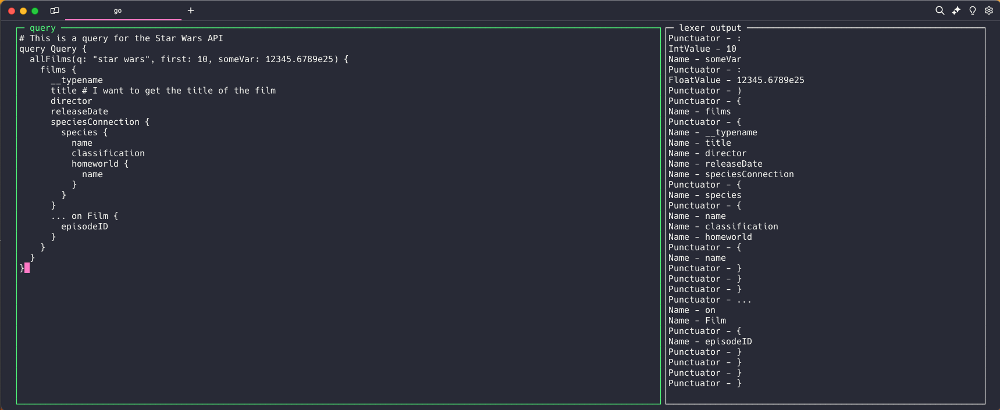

# gql

This is an exploratory project into the world text editors, parsers, and terminal UIs. The end goal is to make a CLI tool that's like curl but for GQL. `gql <some endpoint>` would pop up an editor with schema validation against that endpoint where you can then send the query from.

Current snapshot...

